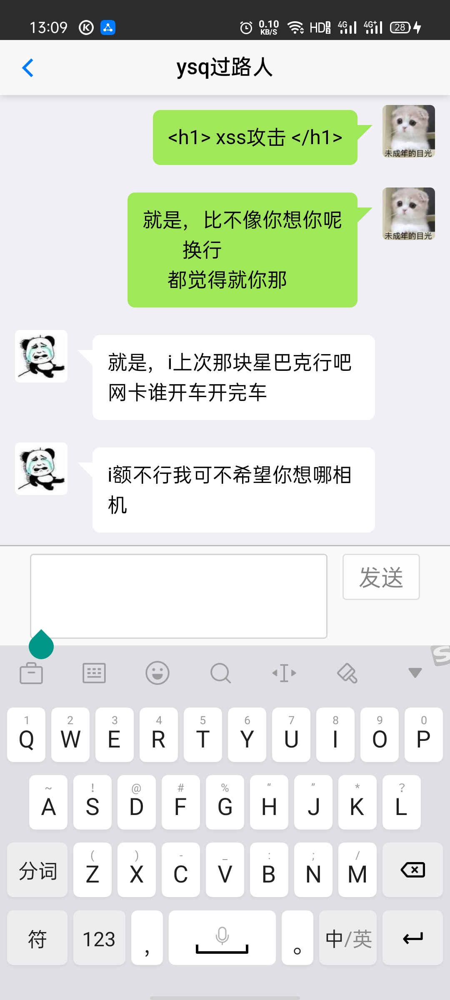
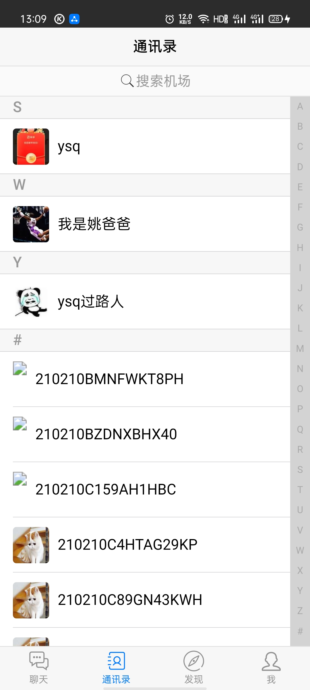

# 效果图

   

# 项目简介

> ​	这是一款类似微信的即时通讯（IM）的混合式APP。
>
> ​	**核心功能**：基于文字的单聊
>
> ​	**主要目的**：学习如何优雅地使用 SpringBoot + Netty 实现即时通讯
>
> ​	别看目前APP的功能不是很多，但是由于前后都安双开，代码量却是相当的大，考虑的细节也是非常的多，涉及到的技术栈也不少，对于一些问题的解决方案也是比较有借鉴性。**适合有SpringBoot和Netty基础，却没有比较正式的实战项目经验的同学！**

# 代码规范

> ​	由于我是强迫症，框架的引入和整合，代码分封装和分层，都写的比较规整。我看过很多教程视频，就算是写业务代码，也会容易犯一些分层不清晰，把大量业务逻辑堆积在了controller，不把一些代码的职责适当抽离放到service或者工具类中。相信各位看代码也会看的比较舒服。
>
> ​	以处理好友申请的接口来看，还算比较优雅吧？？？

~~~java
/**
  * 处理我收到的好友申请
  */
@PostMapping("process")
public ResultModel<String> updateRequestStatus(@NotBlank String requestId, @Range(min = 0, max = 3) byte status,
                                               HttpServletRequest request) {
    // requestId合法性检查
    FriendRequest friendRequest = friendRequestService.getOneFriendRequest(requestId);
    if (ObjectUtils.isEmpty(friendRequest)) { // 好友申请不存在，可能因为requestId错误
        return ResultModel.failed(StatusCode.FRIEND_REQUEST_NOT_EXIST);
    }

    // 已处理过的，禁止重复处理
    if (friendRequest.getStatus() > 0) {
        return ResultModel.failed(StatusCode.REPEAT_PROCESS);
    }

    String myId = (String) request.getAttribute("userId");
    // 没有权限修改其他人的好友申请
    if (!friendRequest.getAcceptUserId().equals(myId)) {
        return ResultModel.failed(StatusCode.NO_PERM);
    }

    // 如果已经是好友，就无法发送申请
    // 情景：都发送了申请，一方同意之后，另一方又同意
    // A发给B（申请为p1），B也发给了A（p2）。B先同意了（p1）。后来A又同意（p2）
    // 这个时候我们需要给A提示说，你们已经是好友了。同时帮A将那条无法处理的申请的状态改为同意
    String senderId = friendRequest.getSendUserId();
    MyFriend friend = friendService.getMyOneFriend(myId, senderId);
    if (!ObjectUtils.isEmpty(friend)) {
        friendRequestService.updateRequestStatus(requestId, (byte) 1);
        return ResultModel.failed(StatusCode.HAVE_BEEN_FRIEND);
    }

    // 修改数据库记录。如果是同意，还需要往好友列表插入一条数据
    friendRequestService.agreeFriendRequest(requestId, status, myId, senderId);

    // 0：尚未处理；1：同意；2：忽略；3：拒绝
    // netty推送
    // 如果是忽略或者拒绝，则不推送；如果是同意，则推送通知
    if (status == 1) {
        MsgModel<String> model = new MsgModel<>();
        model.setAction(MsgActionEnum.PULL_FRIEND.type);
        model.setData(myId); // 把我的id推给发送者
        // 我处理请求，说明我是这条申请的接收者。需要推送给申请的发送者
        UserChannelRepository.pushMsg(senderId, model);
    }

    return ResultModel.success(senderId);  // 返回给我发送者的id
}
~~~

# 学到哪些东西？

> 这里我为什么不说“技术栈”，而是说“学到的东西”。因为不仅仅是包括技术栈，还包括在使用技术的时候的封装技巧、一些坑点、一些问题的解决方案。

## 后端

### 1. Netty + WebSocket

> ​	很多人可能尝试了解过Netty，或许用过Netty写过一些简单的案例，但是Netty的源码可能没有学习过。又或者学习过Netty的源码，但是始终没有用Netty开发过实战项目的经验。那么这个项目的核心和学习目的就是这个。
>
> ​	在这里我抛出一些项目中需要解决的问题：
>
> ​	1、Netty中的Channel和用户的唯一标识如何进行绑定？这关系到了：当收到一条消息，如何快速转发给指定的用户？
>
> ​	2、如何防止一个用户重复创建Channel，造成资源浪费？
>
> ​	3、前后端如何实现心跳？
>
> ​	学习Netty的实战使用，我中途收获到了很多的心得。之后会总结一些博客，欢迎大家一起交流。

### 2. jwt

> ​	由于http协议是无状态的，作为一个前后端分离的项目，必定需要使用token来维护用户会话状态，不然后端不知道你的这一次请求和上一次请求是否来自同一个你。
>
> ​	目前的业务需求，只是用到了登录状态的验证，不需要很严格的权限管理，自然不需要使用shiro或者spring security。很多人在技术选型的时候犯错，为了用技术而用技术，其实这是很没有必要的，技术选型要基于业务需求。
>
> ​	后端jwt的工具类封装、实现一个优雅和严格的登录拦截器，前端全局ajax的封装，等等。

### 3. 通用 Mapper

> ​	mybatis很多人用过，而通用Mapper可以简化一些单表的增删改查操作，大大减少了sql语句的书写。只有一些复杂的sql的时候，才需要我们手写。
>
> ​	如何优雅地引入通用Mapper，其实这是一个模板操作。

### 4. 整合validation，规范实现接口参数的严格校验和错误返回

~~~java
public class ResultModel<T>  {

    // 业务状态码
    private Integer code;
    // 状态描述信息
    private String msg;
    // 返回的数据
    private T data;

    private LocalDateTime time = LocalDateTime.now();
~~~

~~~java
/**
 * 2000 - 成功处理请求
 * 3*** - 重定向，需要进一步的操作已完成请求
 * 4*** - 客户端错误，请求参数错误，语法错误等等
 * 5*** - 服务器内部错误
 * ...
 *
 * @author passerbyYSQ
 * @create 2020-11-02 16:26
 */
// 不加上此注解，Jackson将对象序列化为json时，直接将枚举类转成它的名字
//@JsonFormat(shape = JsonFormat.Shape.OBJECT)
public enum StatusCode {
    SUCCESS(2000, "成功"),

    // 服务器内部错误
    UNKNOWN_ERROR(5000, "未知错误"),
    NO_PERM(5001, "无权限操作"),

    // 参数相关
    PARAM_NOT_COMPLETED(6001, "参数缺失"),
    PARAM_IS_INVALID(6002, "参数无效"),
    FILE_TYPE_INVALID(6003, "非法文件类型"),
    FILE_SIZE_EXCEEDED(6004, "文件大小超出限制"),

    // 用户相关
    USERNAME_IS_EXIST(6101, "用户名已存在"),
    PASSWORD_INCORRECT(6102, "密码错误"),
    USER_NOT_EXIST(6103, "用户不存在"), // 可能是userId错误

    // 账户相关
    TOKEN_IS_MISSING(6200, "token缺失"),
    FORCED_OFFLINE(6201, "异地登录，当前账户被迫下线，请重新登录"),
    TOKEN_IS_EXPIRED(6202, "token已过期"),
    TOKEN_IS_INVALID(6203, "无效token"),

    // 好友相关的
    FRIEND_REQUEST_FREQUENT(6300, "距离上一次好友申请不足半个小时，请勿频繁申请"),
    CAN_NOT_ADD_SELF(6301, "不能添加自己为好友"),
    HAVE_BEEN_FRIEND(6302, "你们已经是好友，请勿重复处理"),
    FRIEND_REQUEST_NOT_EXIST(6303, "好友申请不存在"), // 传参错误
    REPEAT_PROCESS(6304, "请勿重复处理")
    ;

    // 状态码数值
    private Integer code;
    // 状态码描述信息
    private String msg;

    /**
     * 根据业务状态码获取对应的描述信息
     * @param code      业务状态码
     * @return
     */
    public static String getMsgByCode(Integer code) {
        for (StatusCode status : StatusCode.values()) {
            if (status.code.equals(code)) {
                return status.msg;
            }
        }
        return null;
    }
}

~~~

### 5. 使用zxing生成仿微信的个人二维码

https://blog.csdn.net/qq_43290318/article/details/113520761

### 6. 使用阿里的OSS存储图片

### 7. 使用PageHelper实现数据分页

~~~java
package net.ysq.webchat.common;

import java.util.List;

/**
 * 分页数据返回的模型
 *
 * @author passerbyYSQ
 * @create 2021-02-02 23:45
 */
public class PageData<T> {
    private Integer page; // 返回给前端的，被纠正的当前页。可能因为越界而被纠正
    private Integer count; // 每一页显示的记录数。前端不传，会赋默认值
    private Long total; // 总记录数
    private List<T> list; // 当前页的列表数据

    public PageData() {
    }

    public PageData(Integer page, Integer count, Long total, List<T> list) {
        this.page = page;
        this.count = count;
        this.total = total;
        this.list = list;
    }
}
~~~

### 8. 引入mica-xss防xss攻击

> ​	聊天的时候，用户恶意输入脚本（如html标签，js代码等等）怎么办？这是一个不可忽略的安全问题。

### 9. Java8新特性Lambda表达式 和 Stream API 的使用

### 10. redis 的整合和使用

### 11. SpringBoot jar包和war包的切换

### 12. 对base64编码的处理

> ​	前端裁剪之后的头像，以base64编码的形式传给后端。
>
> ​	https://blog.csdn.net/qq_43290318/article/details/113467974

## 前端

### 1. HBuilderX + mui + h5 开发混合APP

### 2. 聊天记录和聊天快照的实现以及存储策略

### 3. 收到消息推送时，界面的实时更新

### 4. 时间的格式化方案

### 5. 头像裁剪

### 6. 按字母分类、可按拼音搜索的联系人列表

### 7. 前端维持心跳

